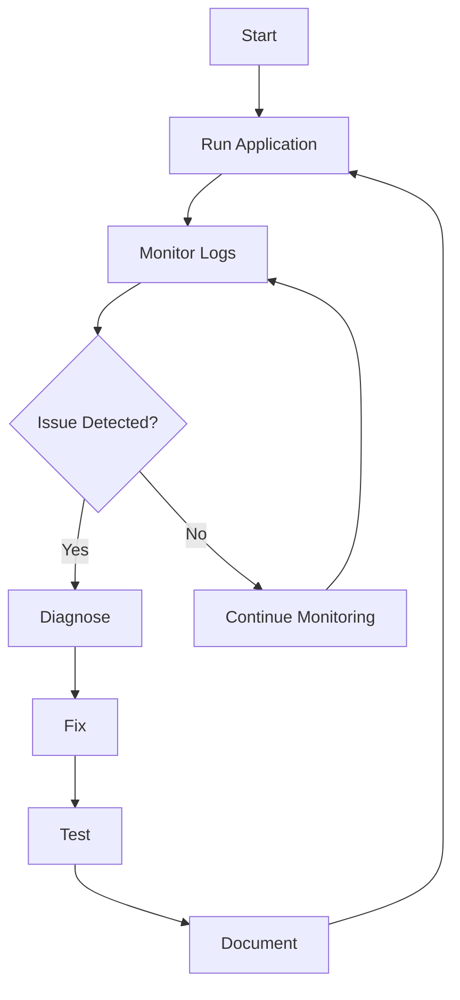

# AI Documentation for Granville Orleans

This directory contains documentation specifically designed for AI assistants working with the Granville Orleans fork and its samples.

## Documents

### 1. [shooter-monitoring-workflow.md](shooter-monitoring-workflow.md)
Comprehensive guide for monitoring and fixing issues in the Shooter game sample, focusing on:
- Bot hang detection and resolution
- Zone transition problem diagnosis
- Real-time log monitoring
- Systematic debugging workflow
- Automated monitoring scripts

## Quick Start for AI Assistants

When working on the Shooter sample:

1. **Start with monitoring**: Use the workflow in `shooter-monitoring-workflow.md`
2. **Run the dev loop**: Execute `./scripts/dev-loop.sh` for automated testing
3. **Use monitoring script**: Run `./scripts/monitor-shooter.sh` for real-time health checks
4. **Check known issues**: Review recent fixes in `/granville/samples/Rpc/docs/`

## Key Areas of Focus

### Current Priorities
1. **Bot Stability**: SSL issues, connection resilience, graceful recovery
2. **Zone Transitions**: Debouncing, timer protection, state consistency
3. **Performance**: Logging optimization, connection pooling, hot path optimization

### Tools Available
- `./scripts/monitor-shooter.sh` - Real-time health monitoring
- `./scripts/dev-loop.sh` - Automated test cycle
- `./scripts/kill-shooter-processes.sh` - Process cleanup
- `./scripts/show-shooter-processes.sh` - Process inspection

## Workflow Summary



## Best Practices

1. **Always monitor before fixing**: Run monitoring to understand current state
2. **Document all fixes**: Update relevant docs in `/granville/samples/Rpc/docs/`
3. **Test thoroughly**: Use the dev-loop script for automated testing
4. **Track patterns**: Look for recurring issues across runs
5. **Commit incrementally**: Make small, focused commits with clear messages

## Common Commands

```bash
# Start full monitoring workflow
cd /mnt/c/forks/orleans/granville/samples/Rpc/Shooter.AppHost
./scripts/dev-loop.sh 300  # Run for 5 minutes

# Monitor in real-time
./scripts/monitor-shooter.sh

# Quick health check
ps aux | grep Shooter | grep -v grep
tail -f ../logs/bot*.log

# Clean restart
./scripts/kill-shooter-processes.sh
./rl.sh
```

## Issue Resolution Priority

| Priority | Issue Type | Action |
|----------|------------|--------|
| P0 | Complete hang/freeze | Immediate restart + diagnosis |
| P1 | Connection failures | Fix resilience logic |
| P2 | Performance degradation | Profile and optimize |
| P3 | Verbose logging | Adjust log levels |

## File Locations

- **Logs**: `/granville/samples/Rpc/logs/`
- **Scripts**: `/granville/samples/Rpc/scripts/`
- **Documentation**: `/granville/samples/Rpc/docs/`
- **Source**: `/granville/samples/Rpc/Shooter.*/`

## Contact Points

When issues arise:
1. Check this documentation first
2. Review recent commits for related fixes
3. Look for patterns in logs
4. Test with minimal configuration
5. Document findings for future reference