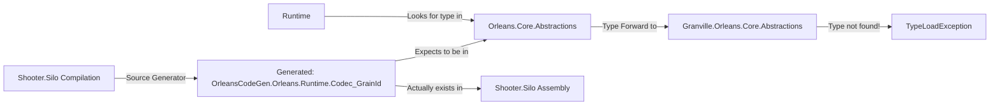

# Orleans CodeGen Types Issue Analysis

## Problem Statement

When running the Shooter sample with our shim packages, we encounter:
```
System.TypeLoadException: Could not load type 'OrleansCodeGen.Orleans.Runtime.Codec_GrainId' 
from assembly 'Orleans.Core.Abstractions, Version=9.0.0.0, Culture=neutral, PublicKeyToken=null'
```

## Technical Analysis

### How Orleans Code Generation Works

1. Orleans uses source generators to create serialization codecs
2. These generators run during compilation of consuming assemblies (e.g., Shooter.Silo)
3. Generated types follow the pattern: `OrleansCodeGen.<OriginalNamespace>.<TypeName>`
4. The generated code expects these types to exist in the original Orleans assemblies

### The Assembly Mismatch



### Why This Happens

1. **Compilation Time**: 
   - Shooter.Silo references Granville.Orleans packages
   - Source generator creates codec types in Shooter.Silo assembly
   - Generated code has attributes pointing to Orleans.Core.Abstractions

2. **Runtime**:
   - Type loader looks for `OrleansCodeGen.Orleans.Runtime.Codec_GrainId` in Orleans.Core.Abstractions
   - Our shim forwards to Granville.Orleans.Core.Abstractions
   - But the type doesn't exist there - it's in Shooter.Silo!

## Detailed Solution Options

### Option 1: Modify AssemblyRedirectHelper (Recommended)

Enhance the existing redirect helper to handle OrleansCodeGen types specially:

```csharp
private static Assembly HandleOrleansCodeGenTypes(string assemblyName, AssemblyName requestedAssembly)
{
    // If looking for OrleansCodeGen types in Orleans assemblies
    if (requestedAssembly.Name.StartsWith("Orleans.") && 
        assemblyName.Contains("OrleansCodeGen"))
    {
        // Look in all loaded assemblies for the type
        foreach (var assembly in AppDomain.CurrentDomain.GetAssemblies())
        {
            try
            {
                var type = assembly.GetType(assemblyName);
                if (type != null) return assembly;
            }
            catch { }
        }
    }
    return null;
}
```

### Option 2: Custom Type Resolver

Implement a more sophisticated type resolution system:

```csharp
public class OrleansCodeGenTypeResolver
{
    private static readonly ConcurrentDictionary<string, Type> _typeCache = new();
    
    public static void Initialize()
    {
        AppDomain.CurrentDomain.TypeResolve += ResolveCodeGenType;
    }
    
    private static Assembly ResolveCodeGenType(object sender, ResolveEventArgs args)
    {
        if (args.Name.Contains("OrleansCodeGen"))
        {
            // Extract the actual type name
            var typeName = args.Name;
            
            // Search in all loaded assemblies
            foreach (var assembly in AppDomain.CurrentDomain.GetAssemblies())
            {
                var type = assembly.GetType(typeName);
                if (type != null)
                {
                    _typeCache.TryAdd(typeName, type);
                    return assembly;
                }
            }
        }
        return null;
    }
}
```

### Option 3: Shim Assembly with Generated Types

Create a companion shim that includes common generated types:

1. Build a sample project that uses all Orleans types
2. Extract the generated OrleansCodeGen types
3. Create forwarding shims for these types
4. Include in shim packages

Challenges:
- Generated types vary by consuming assembly
- Maintenance burden
- Version compatibility issues

### Option 4: Source Generator Modification

Modify the Orleans source generator to:
1. Generate types that reference Granville assemblies when detected
2. Or generate types in a neutral location
3. Or use a different type resolution strategy

This requires changes to `/src/Orleans.CodeGenerator/CodeGenerator.cs`

## Recommended Implementation Plan

1. **Short Term** (Fastest to implement):
   - Enhance AssemblyRedirectHelper in Shooter.Shared
   - Add special handling for OrleansCodeGen types
   - Test with Shooter sample

2. **Medium Term**:
   - Create a reusable OrleansCodeGenTypeResolver
   - Package it as part of Granville.Orleans.Core
   - Document usage for consumers

3. **Long Term**:
   - Investigate modifying the source generator
   - Submit changes upstream to Orleans if applicable
   - Maintain compatibility with standard Orleans

## Testing Approach

1. Implement the enhanced AssemblyRedirectHelper
2. Run Shooter.Silo and verify it starts
3. Check that serialization works correctly
4. Test with other types that use code generation

## Code Location

The fix should be implemented in:
- `/granville/samples/Rpc/Shooter.Shared/AssemblyRedirectHelper.cs`

And potentially extracted to:
- `/src/Orleans.Core/CodeGen/OrleansCodeGenTypeResolver.cs`