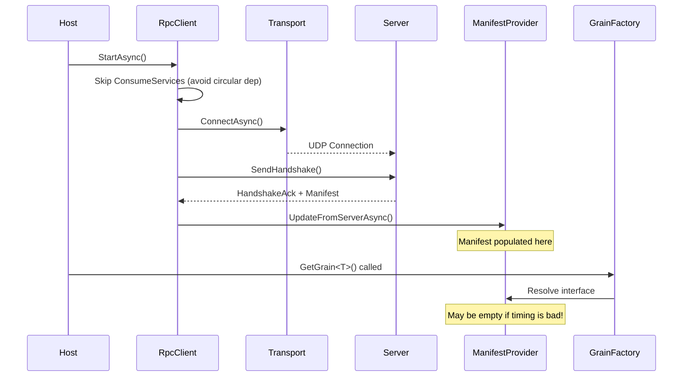

# Service Registration Timing Analysis for RPC Client

## Executive Summary

The RPC client is experiencing service registration timing issues that prevent `GetGrain<T>()` from working properly. The core problem is a race condition between:
1. The manifest provider being populated with grain types from the server
2. The grain factory trying to resolve interface types to grain types

## Detailed Analysis

### 1. Service Registration Order

The service registration happens in `DefaultRpcClientServices.AddDefaultServices()`:

```
1. Basic services (logging, options, statistics)
2. RpcClient as singleton + IHostedService
3. MultiServerManifestProvider (keyed as "rpc")
4. GrainInterfaceTypeToGrainTypeResolver (keyed as "rpc", depends on manifest provider)
5. RpcGrainFactory (uses keyed resolver)
6. IGrainFactory (keyed as "rpc", points to RpcGrainFactory)
```

### 2. Initialization Sequence



### 3. Critical Timing Issues Identified

#### Issue 1: Manifest Not Ready When GetGrain Called

**Root Cause**: The manifest is populated asynchronously during handshake, but `GetGrain` can be called immediately after `StartAsync()` returns.

**Evidence**:
- Client logs show "GetGrain call timed out" immediately after connection
- Server logs show successful handshake with manifest delivery
- The manifest update happens in `HandleHandshakeAck` which runs async

#### Issue 2: Service Resolution Timing

**Root Cause**: The keyed services are registered but may not be fully initialized when accessed.

**Evidence**:
- `RpcGrainFactory` constructor gets the keyed resolver
- But the resolver depends on the manifest provider which is empty initially

#### Issue 3: Transport Connection Race

**Root Cause**: The UDP connection establishment is async and the handshake response handling is also async.

**Evidence**:
- Test program shows "Failed to connect to server at 127.0.0.1:12000 within 5000ms"
- But server logs show connections are accepted
- This suggests a transport-level timing issue

### 4. Specific Code Problems

#### Problem 1: No Synchronization Between Connection and GetGrain

In `RpcClient.StartAsync()`:
```csharp
await ConnectToInitialServersAsync(cancellationToken);
// Returns immediately, handshake may still be in flight!
```

In user code:
```csharp
await host.StartAsync();
var grain = rpcClient.GetGrain<IGameRpcGrain>("game"); // Too early!
```

#### Problem 2: Manifest Provider Updates Are Fire-and-Forget

In `HandleHandshakeAck()`:
```csharp
await multiServerManifestProvider.UpdateFromServerAsync(serverId, handshakeAck.GrainManifest);
// No way for caller to know when this completes
```

#### Problem 3: EnsureConnected Only Checks Connection Count

```csharp
private void EnsureConnected()
{
    if (connectionCount == 0)
        throw new InvalidOperationException("RPC client is not connected to any servers");
    // But connected != manifest ready!
}
```

## Proposed Solutions

### Solution 1: Add Manifest Ready State

Add a method to wait for manifest population:

```csharp
public interface IRpcClient
{
    Task WaitForManifestAsync(TimeSpan timeout = default);
}

public async Task WaitForManifestAsync(TimeSpan timeout = default)
{
    var manifestProvider = _manifestProvider as MultiServerManifestProvider;
    if (manifestProvider == null) return;
    
    timeout = timeout == default ? TimeSpan.FromSeconds(10) : timeout;
    var cts = new CancellationTokenSource(timeout);
    
    while (!cts.Token.IsCancellationRequested)
    {
        var manifest = manifestProvider.Current;
        if (manifest?.AllGrainManifests.Any(m => m.Grains.Count > 0) == true)
        {
            return;
        }
        await Task.Delay(100, cts.Token);
    }
    
    throw new TimeoutException("Manifest not populated within timeout");
}
```

### Solution 2: Make StartAsync Wait for Initial Manifest

Modify `ConnectToInitialServersAsync` to wait for at least one manifest:

```csharp
private async Task ConnectToInitialServersAsync(CancellationToken cancellationToken)
{
    // ... existing connection code ...
    
    // Wait for at least one manifest
    var manifestWaitCts = CancellationTokenSource.CreateLinkedTokenSource(cancellationToken);
    manifestWaitCts.CancelAfter(TimeSpan.FromSeconds(5));
    
    while (!manifestWaitCts.Token.IsCancellationRequested)
    {
        if (_manifestProvider is MultiServerManifestProvider mp && 
            mp.Current?.AllGrainManifests.Any(m => m.Grains.Count > 0) == true)
        {
            break;
        }
        await Task.Delay(50, manifestWaitCts.Token);
    }
}
```

### Solution 3: Add Connection State Machine

Implement proper connection states:

```csharp
public enum RpcConnectionState
{
    Disconnected,
    Connecting,
    Connected,
    HandshakeSent,
    ManifestReceived,
    Ready
}
```

### Solution 4: Fix Transport Connection Issues

The LiteNetLib transport appears to have issues with connection establishment. Consider:
1. Increasing connection timeout
2. Adding retry logic with backoff
3. Checking for firewall/network issues in WSL

## Immediate Fix Recommendations

1. **Quick Fix**: Add a delay after StartAsync in client code:
   ```csharp
   await host.StartAsync();
   await Task.Delay(2000); // Give time for manifest
   var grain = rpcClient.GetGrain<T>();
   ```

2. **Better Fix**: Implement WaitForManifestAsync and call it:
   ```csharp
   await host.StartAsync();
   await rpcClient.WaitForManifestAsync();
   var grain = rpcClient.GetGrain<T>();
   ```

3. **Best Fix**: Make StartAsync properly wait for initial connection and manifest before returning.

## Testing Plan

1. Create unit tests for manifest population timing
2. Create integration tests with delays to verify race conditions
3. Add connection state logging for debugging
4. Test with multiple servers connecting simultaneously
5. Test reconnection scenarios

## Conclusion

The service registration timing issues stem from asynchronous operations that aren't properly coordinated. The manifest provider needs data from the server before the grain factory can work, but there's no synchronization mechanism to ensure this happens before `GetGrain` is called.