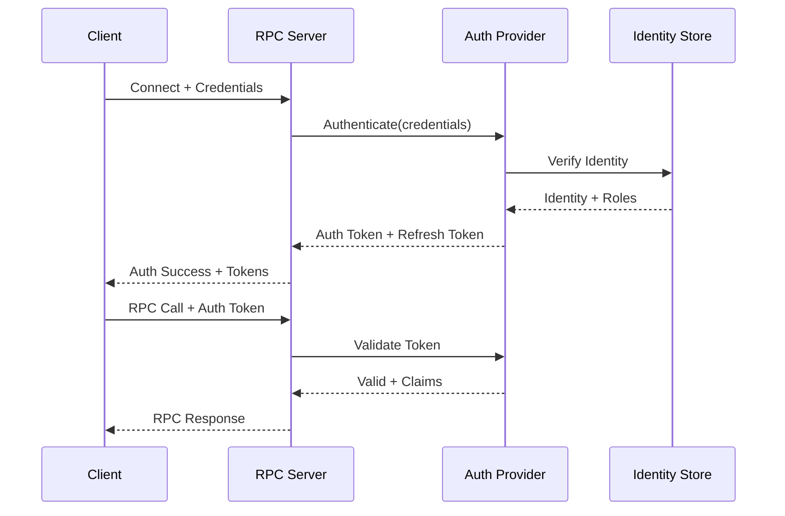
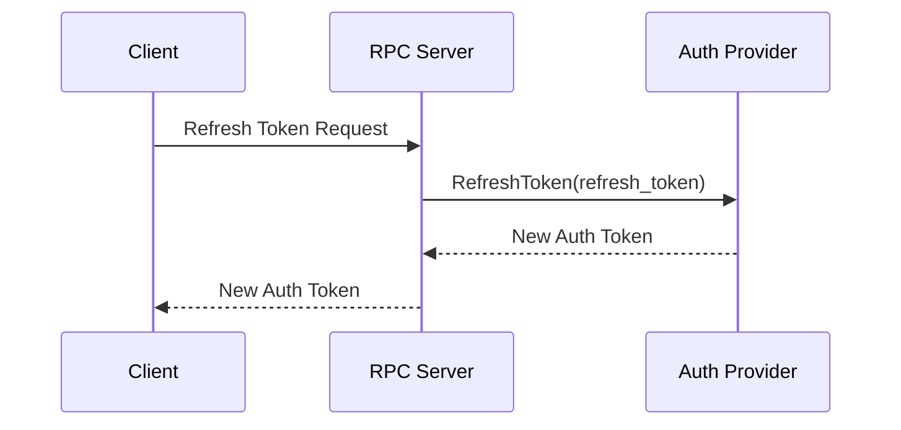

# Granville RPC Authentication Design

## Overview
This document describes the authentication architecture for Granville RPC, providing secure client and server identity verification while maintaining high performance.

## Design Goals

1. **Security**: Strong authentication resistant to common attacks
2. **Performance**: Minimal latency overhead (< 1ms)
3. **Scalability**: Support millions of concurrent connections
4. **Flexibility**: Multiple authentication methods
5. **Simplicity**: Easy to implement and use

## Authentication Architecture

### Component Overview

```
┌─────────────┐     ┌──────────────────┐     ┌─────────────────┐
│  RPC Client ├────►│ Auth Middleware  ├────►│ Auth Provider   │
└─────────────┘     └──────────────────┘     └─────────────────┘
                             │                         │
                             ▼                         ▼
                    ┌──────────────────┐     ┌─────────────────┐
                    │ Token Validator  │     │ Identity Store  │
                    └──────────────────┘     └─────────────────┘
```

### Core Components

#### 1. Authentication Provider Interface
```csharp
public interface IAuthenticationProvider
{
    Task<AuthenticationResult> AuthenticateAsync(
        AuthenticationRequest request, 
        CancellationToken cancellationToken);
    
    Task<bool> ValidateTokenAsync(
        string token, 
        CancellationToken cancellationToken);
    
    Task<string> RefreshTokenAsync(
        string refreshToken, 
        CancellationToken cancellationToken);
}
```

#### 2. Authentication Schemes

##### JWT-Based Authentication (Default)
- **Pros**: Stateless, standard format, wide support
- **Cons**: Larger token size, requires key management
- **Use Case**: General purpose, web applications

##### Custom Token Authentication
- **Pros**: Optimized size, custom claims
- **Cons**: Non-standard, more implementation work
- **Use Case**: High-performance gaming

##### Certificate-Based Authentication
- **Pros**: Strong security, mutual TLS
- **Cons**: Complex management, higher overhead
- **Use Case**: Server-to-server communication

##### API Key Authentication
- **Pros**: Simple, fast validation
- **Cons**: Less secure, no user context
- **Use Case**: Service accounts, testing

## Authentication Flow

### Initial Authentication



### Token Refresh Flow



## Token Design

### JWT Token Structure
```json
{
  "header": {
    "alg": "RS256",
    "typ": "JWT",
    "kid": "2024-01-15"
  },
  "payload": {
    "sub": "user123",
    "aud": "granville-rpc",
    "iss": "auth.granville.com",
    "exp": 1710360000,
    "iat": 1710356400,
    "roles": ["client", "premium"],
    "sid": "session-abc123",
    "custom": {
      "region": "us-west",
      "game_id": "shooter-01"
    }
  }
}
```

### Custom Token Format (Binary)
```
[Version:1][Type:1][Length:2][UserID:16][Expiry:8][Roles:4][HMAC:32]
Total: 64 bytes (vs ~300 bytes for JWT)
```

## Implementation Details

### Client-Side Implementation

```csharp
public class RpcClientAuthentication
{
    private string _authToken;
    private string _refreshToken;
    private DateTime _tokenExpiry;
    
    public async Task<bool> AuthenticateAsync(ICredentials credentials)
    {
        var request = new AuthenticationRequest
        {
            Credentials = credentials,
            ClientInfo = GetClientInfo()
        };
        
        var result = await _authProvider.AuthenticateAsync(request);
        
        if (result.Success)
        {
            _authToken = result.AuthToken;
            _refreshToken = result.RefreshToken;
            _tokenExpiry = result.Expiry;
            
            // Set up automatic refresh
            ScheduleTokenRefresh();
        }
        
        return result.Success;
    }
    
    private void AttachTokenToRequest(RpcRequest request)
    {
        request.Headers["Authorization"] = $"Bearer {_authToken}";
    }
}
```

### Server-Side Middleware

```csharp
public class AuthenticationMiddleware : IRpcMiddleware
{
    private readonly IAuthenticationProvider _authProvider;
    private readonly ITokenCache _tokenCache;
    
    public async Task<RpcResponse> ProcessAsync(
        RpcRequest request, 
        RpcRequestDelegate next)
    {
        // Extract token from request
        if (!TryExtractToken(request, out var token))
        {
            return RpcResponse.Unauthorized("Missing authentication token");
        }
        
        // Check cache first for performance
        var cacheKey = ComputeTokenHash(token);
        if (_tokenCache.TryGet(cacheKey, out var cachedClaims))
        {
            request.Context.User = cachedClaims;
            return await next(request);
        }
        
        // Validate token
        var validation = await _authProvider.ValidateTokenAsync(token);
        if (!validation.IsValid)
        {
            return RpcResponse.Unauthorized("Invalid authentication token");
        }
        
        // Cache for future requests
        _tokenCache.Set(cacheKey, validation.Claims, TimeSpan.FromMinutes(5));
        
        // Set user context
        request.Context.User = validation.Claims;
        
        return await next(request);
    }
}
```

## Security Considerations

### Token Security
1. **Short Expiration**: Auth tokens expire in 15-60 minutes
2. **Refresh Tokens**: Longer-lived, stored securely
3. **Token Binding**: Optionally bind to IP/device
4. **Revocation**: Support immediate token revocation

### Key Management
1. **Key Rotation**: Regular rotation schedule
2. **Key Storage**: Hardware security modules for production
3. **Key Distribution**: Secure key exchange protocols
4. **Backup Keys**: Disaster recovery procedures

### Attack Prevention

#### Replay Attack Prevention
- Include nonce in token
- Timestamp validation
- One-time token usage tracking

#### Token Theft Mitigation
- Device fingerprinting
- IP address validation
- Behavioral analysis
- Immediate revocation capability

## Performance Optimization

### Caching Strategy
```csharp
public class TokenCache
{
    // Two-tier cache: L1 in-process, L2 distributed
    private readonly IMemoryCache _l1Cache;
    private readonly IDistributedCache _l2Cache;
    
    public async Task<bool> TryGetAsync(string key, out TokenClaims claims)
    {
        // Check L1 first (fastest)
        if (_l1Cache.TryGetValue(key, out claims))
            return true;
        
        // Check L2 (distributed)
        var cached = await _l2Cache.GetAsync(key);
        if (cached != null)
        {
            claims = Deserialize(cached);
            _l1Cache.Set(key, claims); // Populate L1
            return true;
        }
        
        return false;
    }
}
```

### Benchmarks
- Token validation: < 0.1ms (cached)
- Token validation: < 1ms (uncached)
- Initial authentication: < 10ms
- Token refresh: < 5ms

## Configuration

### Authentication Options
```json
{
  "Authentication": {
    "DefaultScheme": "JWT",
    "TokenExpiration": "00:30:00",
    "RefreshTokenExpiration": "7.00:00:00",
    "RequireHttps": true,
    "EnableCaching": true,
    "CacheDuration": "00:05:00",
    "JWT": {
      "Issuer": "auth.granville.com",
      "Audience": "granville-rpc",
      "SigningKey": "base64-encoded-key",
      "ValidateLifetime": true,
      "ClockSkew": "00:00:30"
    },
    "CustomToken": {
      "Secret": "base64-encoded-secret",
      "HashAlgorithm": "SHA256"
    }
  }
}
```

## Multi-Factor Authentication (MFA)

### MFA Flow
1. Initial authentication with username/password
2. Server returns MFA challenge
3. Client provides MFA code (TOTP, SMS, etc.)
4. Server validates and issues tokens

### Implementation
```csharp
public class MfaAuthenticationProvider : IAuthenticationProvider
{
    public async Task<AuthenticationResult> AuthenticateAsync(
        AuthenticationRequest request)
    {
        // First factor: credentials
        var user = await ValidateCredentials(request.Credentials);
        if (user == null)
            return AuthenticationResult.Failed("Invalid credentials");
        
        // Check if MFA required
        if (user.MfaEnabled)
        {
            // Send MFA challenge
            var challenge = await SendMfaChallenge(user);
            return AuthenticationResult.MfaRequired(challenge);
        }
        
        // No MFA, issue tokens
        return await IssueTokens(user);
    }
    
    public async Task<AuthenticationResult> CompleteMfaAsync(
        MfaCompletionRequest request)
    {
        // Validate MFA code
        if (!await ValidateMfaCode(request.UserId, request.Code))
            return AuthenticationResult.Failed("Invalid MFA code");
        
        // Issue tokens
        var user = await GetUser(request.UserId);
        return await IssueTokens(user);
    }
}
```

## Integration Examples

### Unity Game Client
```csharp
public class UnityRpcClient
{
    private RpcClient _rpcClient;
    
    public async Task<bool> LoginAsync(string username, string password)
    {
        var credentials = new UsernamePasswordCredentials(username, password);
        
        var authenticated = await _rpcClient.AuthenticateAsync(credentials);
        
        if (authenticated)
        {
            // Store refresh token securely
            PlayerPrefs.SetString("RefreshToken", _rpcClient.RefreshToken);
            PlayerPrefs.Save();
        }
        
        return authenticated;
    }
}
```

### Server-to-Server
```csharp
public class ServerAuthenticationProvider
{
    public async Task<IAuthenticationProvider> CreateServerAuth()
    {
        return new CertificateAuthenticationProvider
        {
            ClientCertificate = LoadCertificate("server.pfx"),
            TrustedCertificates = LoadTrustedCerts(),
            ValidateChain = true
        };
    }
}
```

## Monitoring & Metrics

### Key Metrics
- Authentication success rate
- Token validation latency
- Failed authentication attempts
- Token refresh rate
- MFA usage statistics

### Alerts
- Brute force attempts
- Unusual authentication patterns
- Certificate expiration warnings
- Key rotation reminders

## Future Enhancements

1. **Biometric Authentication**: Fingerprint, face recognition
2. **WebAuthn Support**: Passwordless authentication
3. **Decentralized Identity**: Blockchain-based identity
4. **Risk-Based Authentication**: Adaptive authentication
5. **Zero-Knowledge Proofs**: Privacy-preserving auth