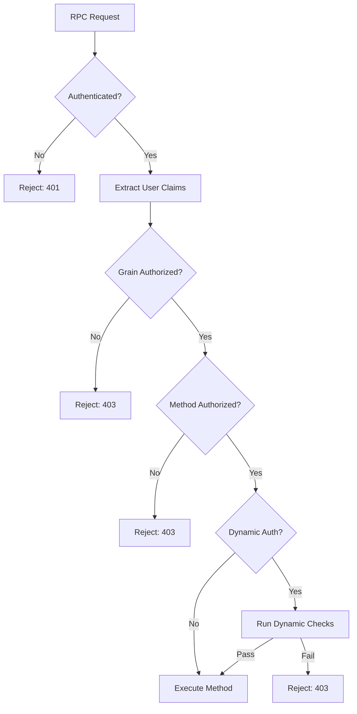

# Granville RPC Authorization Design

## Overview
This document outlines the authorization system for Granville RPC, implementing Role-Based Access Control (RBAC) with support for fine-grained permissions on RpcGrains and methods.

## Design Principles

1. **Secure by Default**: Deny access unless explicitly granted
2. **Performance**: Minimal overhead for authorization checks
3. **Flexibility**: Support various authorization scenarios
4. **Clarity**: Clear, declarative authorization rules
5. **Auditability**: Track all authorization decisions

## Authorization Model

### Role Hierarchy

```
Admin
  ├── Server
  │     └── Specialized-Server
  └── Client
        └── Premium-Client
              └── Basic-Client
```

### Permission Model

```csharp
public class Permission
{
    public string Resource { get; set; }  // e.g., "RpcGrain:PlayerGrain"
    public string Action { get; set; }    // e.g., "Create", "Invoke:GetStats"
    public string[] Conditions { get; set; } // e.g., ["owner:self", "time:business_hours"]
}
```

## Authorization Attributes

### Grain-Level Authorization

```csharp
// Entire grain requires server role
[RpcGrain]
[RequireRole("server")]
public class AdminGrain : RpcGrain
{
    // All methods inherit grain-level authorization
}

// Multiple roles allowed
[RpcGrain]
[RequireAnyRole("server", "specialized-server")]
public class ActionServerGrain : RpcGrain
{
    // Either role can access
}

// All roles required
[RpcGrain]
[RequireAllRoles("authenticated", "premium")]
public class PremiumFeatureGrain : RpcGrain
{
    // Must have both roles
}
```

### Method-Level Authorization

```csharp
[RpcGrain]
public class PlayerGrain : RpcGrain
{
    // Public method - no authorization required
    [AllowAnonymous]
    public Task<PlayerInfo> GetPublicInfo() { }
    
    // Owner or admin only
    [RequireOwnerOrRole("admin")]
    public Task<PlayerStats> GetPrivateStats() { }
    
    // Multiple authorization options
    [RequireRole("admin")]
    [RequirePermission("player:modify")]
    public Task ModifyPlayer(PlayerData data) { }
    
    // Custom authorization logic
    [RequireCustomAuthorization(typeof(GameMasterAuthorizer))]
    public Task PerformGameMasterAction() { }
}
```

### Dynamic Authorization

```csharp
[RpcGrain]
public class GameGrain : RpcGrain
{
    // Authorization based on grain state
    [RequireDynamicAuthorization]
    public async Task<bool> JoinGame(string playerId)
    {
        var authContext = GetAuthorizationContext();
        
        // Check if game is public or player is invited
        if (State.IsPublic || State.InvitedPlayers.Contains(playerId))
        {
            return authContext.Succeed();
        }
        
        // Check if player is friend of game owner
        if (await IsFriendOfOwner(playerId))
        {
            return authContext.Succeed();
        }
        
        return authContext.Fail("Not authorized to join this game");
    }
}
```

## Authorization Pipeline

### Request Flow



### Authorization Context

```csharp
public class AuthorizationContext
{
    public ClaimsPrincipal User { get; set; }
    public string GrainType { get; set; }
    public string GrainId { get; set; }
    public string MethodName { get; set; }
    public object[] MethodParameters { get; set; }
    public IGrainState GrainState { get; set; }
    public Dictionary<string, object> Resources { get; set; }
}
```

## Implementation Details

### Authorization Middleware

```csharp
public class AuthorizationMiddleware : IRpcMiddleware
{
    private readonly IAuthorizationService _authService;
    private readonly IAuthorizationPolicyProvider _policyProvider;
    
    public async Task<RpcResponse> ProcessAsync(
        RpcRequest request, 
        RpcRequestDelegate next)
    {
        // Get user from authentication
        var user = request.Context.User;
        
        // Build authorization context
        var authContext = new AuthorizationContext
        {
            User = user,
            GrainType = request.GrainType,
            GrainId = request.GrainId,
            MethodName = request.MethodName,
            MethodParameters = request.Parameters
        };
        
        // Check grain-level authorization
        var grainPolicy = await _policyProvider.GetGrainPolicy(request.GrainType);
        if (grainPolicy != null)
        {
            var grainAuthResult = await _authService.AuthorizeAsync(
                user, authContext, grainPolicy);
                
            if (!grainAuthResult.Succeeded)
            {
                return RpcResponse.Forbidden(
                    $"Access denied to grain {request.GrainType}");
            }
        }
        
        // Check method-level authorization
        var methodPolicy = await _policyProvider.GetMethodPolicy(
            request.GrainType, request.MethodName);
            
        if (methodPolicy != null)
        {
            var methodAuthResult = await _authService.AuthorizeAsync(
                user, authContext, methodPolicy);
                
            if (!methodAuthResult.Succeeded)
            {
                return RpcResponse.Forbidden(
                    $"Access denied to method {request.MethodName}");
            }
        }
        
        // Proceed with request
        return await next(request);
    }
}
```

### Authorization Service

```csharp
public class RpcAuthorizationService : IAuthorizationService
{
    private readonly IRoleService _roleService;
    private readonly IPermissionService _permissionService;
    private readonly IAuditService _auditService;
    
    public async Task<AuthorizationResult> AuthorizeAsync(
        ClaimsPrincipal user,
        AuthorizationContext context,
        AuthorizationPolicy policy)
    {
        var result = new AuthorizationResult();
        
        try
        {
            // Check each requirement in the policy
            foreach (var requirement in policy.Requirements)
            {
                var authorized = await CheckRequirement(
                    user, context, requirement);
                    
                if (!authorized)
                {
                    result.Fail(requirement.FailureMessage);
                    break;
                }
            }
            
            // Audit the authorization decision
            await _auditService.LogAuthorizationAsync(
                user, context, result);
                
            return result;
        }
        catch (Exception ex)
        {
            // Fail closed on errors
            result.Fail($"Authorization error: {ex.Message}");
            return result;
        }
    }
    
    private async Task<bool> CheckRequirement(
        ClaimsPrincipal user,
        AuthorizationContext context,
        IAuthorizationRequirement requirement)
    {
        switch (requirement)
        {
            case RoleRequirement roleReq:
                return await _roleService.UserHasRoleAsync(
                    user, roleReq.RequiredRole);
                    
            case PermissionRequirement permReq:
                return await _permissionService.UserHasPermissionAsync(
                    user, permReq.Permission);
                    
            case OwnerRequirement ownerReq:
                return await CheckOwnership(user, context);
                
            case CustomRequirement customReq:
                return await customReq.EvaluateAsync(user, context);
                
            default:
                return false;
        }
    }
}
```

### Policy Configuration

```csharp
public class AuthorizationPolicyBuilder
{
    public void ConfigureGrainPolicies(GrainPolicyCollection policies)
    {
        // Admin grains require admin role
        policies.ForGrainsMatching("*Admin*")
            .RequireRole("admin");
            
        // Game grains require authentication
        policies.ForGrainsMatching("*Game*")
            .RequireAuthenticatedUser();
            
        // Premium features require premium role
        policies.ForGrainsMatching("Premium*")
            .RequireRole("premium");
    }
    
    public void ConfigureMethodPolicies(MethodPolicyCollection policies)
    {
        // All Delete methods require admin
        policies.ForMethodsMatching("Delete*")
            .RequireRole("admin");
            
        // Get methods are generally public
        policies.ForMethodsMatching("Get*")
            .AllowAnonymous()
            .Except("GetPrivate*", policy => policy.RequireAuthentication());
    }
}
```

## Role Management

### Role Definition

```csharp
public class Role
{
    public string Name { get; set; }
    public string Description { get; set; }
    public List<Permission> Permissions { get; set; }
    public List<string> InheritedRoles { get; set; }
}

// Example role definitions
public static class DefaultRoles
{
    public static readonly Role Client = new Role
    {
        Name = "client",
        Description = "Basic client access",
        Permissions = new List<Permission>
        {
            new Permission { Resource = "PlayerGrain", Action = "Read:Self" },
            new Permission { Resource = "GameGrain", Action = "Join" },
            new Permission { Resource = "ChatGrain", Action = "Send" }
        }
    };
    
    public static readonly Role Server = new Role
    {
        Name = "server",
        Description = "Server-to-server access",
        InheritedRoles = new List<string> { "client" },
        Permissions = new List<Permission>
        {
            new Permission { Resource = "ActionServerGrain", Action = "*" },
            new Permission { Resource = "GameGrain", Action = "Manage" },
            new Permission { Resource = "MetricsGrain", Action = "Write" }
        }
    };
}
```

### Dynamic Role Assignment

```csharp
public class DynamicRoleProvider : IRoleProvider
{
    public async Task<IEnumerable<string>> GetUserRolesAsync(
        ClaimsPrincipal user)
    {
        var roles = new List<string>();
        
        // Get static roles from claims
        roles.AddRange(user.FindAll(ClaimTypes.Role)
            .Select(c => c.Value));
            
        // Add dynamic roles based on context
        if (await IsGameMaster(user))
        {
            roles.Add("game-master");
        }
        
        if (await IsPremiumSubscriber(user))
        {
            roles.Add("premium");
        }
        
        // Time-based roles
        if (IsSpecialEventActive())
        {
            roles.Add("event-participant");
        }
        
        return roles;
    }
}
```

## Resource-Based Authorization

### Resource Ownership

```csharp
[RpcGrain]
public class PlayerInventoryGrain : RpcGrain, IOwnedResource
{
    public string OwnerId => State.PlayerId;
    
    [RequireOwnerOrRole("admin")]
    public Task<Item> AddItem(Item item)
    {
        // Only owner or admin can add items
    }
    
    [RequireOwner]
    public Task<bool> DeleteItem(string itemId)
    {
        // Only owner can delete their items
    }
    
    [AllowAnonymous]
    public Task<List<Item>> GetPublicShowcase()
    {
        // Anyone can view showcase items
    }
}
```

### Hierarchical Resources

```csharp
public class GuildAuthorizationHandler : IAuthorizationHandler
{
    public async Task<bool> HandleAsync(
        AuthorizationContext context)
    {
        // Check guild hierarchy
        var userGuildRole = await GetUserGuildRole(
            context.User, 
            context.Resources["guildId"]);
            
        switch (context.MethodName)
        {
            case "KickMember":
                return userGuildRole >= GuildRole.Officer;
                
            case "PromoteMember":
                return userGuildRole >= GuildRole.Leader;
                
            case "DisbandGuild":
                return userGuildRole == GuildRole.Owner;
                
            default:
                return userGuildRole >= GuildRole.Member;
        }
    }
}
```

## Performance Optimization

### Authorization Caching

```csharp
public class CachedAuthorizationService : IAuthorizationService
{
    private readonly IMemoryCache _cache;
    private readonly IAuthorizationService _innerService;
    
    public async Task<AuthorizationResult> AuthorizeAsync(
        ClaimsPrincipal user,
        AuthorizationContext context,
        AuthorizationPolicy policy)
    {
        // Generate cache key
        var cacheKey = GenerateCacheKey(user, context, policy);
        
        // Check cache
        if (_cache.TryGetValue(cacheKey, out AuthorizationResult cached))
        {
            return cached;
        }
        
        // Perform authorization
        var result = await _innerService.AuthorizeAsync(
            user, context, policy);
            
        // Cache result
        _cache.Set(cacheKey, result, TimeSpan.FromMinutes(5));
        
        return result;
    }
}
```

### Batch Authorization

```csharp
public class BatchAuthorizationService
{
    public async Task<Dictionary<string, bool>> AuthorizeBatchAsync(
        ClaimsPrincipal user,
        IEnumerable<AuthorizationRequest> requests)
    {
        // Group by policy for efficiency
        var groupedRequests = requests.GroupBy(r => r.PolicyName);
        
        var results = new Dictionary<string, bool>();
        
        foreach (var group in groupedRequests)
        {
            var policy = await GetPolicy(group.Key);
            
            // Authorize all requests with same policy together
            var batchResults = await AuthorizeBatchWithPolicy(
                user, group, policy);
                
            foreach (var result in batchResults)
            {
                results[result.Key] = result.Value;
            }
        }
        
        return results;
    }
}
```

## Security Considerations

### Authorization Bypass Prevention

1. **Default Deny**: No implicit permissions
2. **Fail Closed**: Errors result in denial
3. **No Client Trust**: All checks server-side
4. **Immutable Policies**: Policies cannot be modified at runtime

### Audit Trail

```csharp
public class AuthorizationAuditEntry
{
    public DateTime Timestamp { get; set; }
    public string UserId { get; set; }
    public string Resource { get; set; }
    public string Action { get; set; }
    public bool Allowed { get; set; }
    public string Reason { get; set; }
    public string ClientIP { get; set; }
    public Dictionary<string, object> Context { get; set; }
}
```

## Configuration

### Authorization Settings

```json
{
  "Authorization": {
    "DefaultPolicy": "RequireAuthentication",
    "EnableCaching": true,
    "CacheDuration": "00:05:00",
    "AuditLevel": "FailuresOnly",
    "Policies": {
      "RequireAdmin": {
        "Requirements": [
          {
            "Type": "Role",
            "Role": "admin"
          }
        ]
      },
      "GameAccess": {
        "Requirements": [
          {
            "Type": "AnyRole",
            "Roles": ["client", "server"]
          },
          {
            "Type": "Custom",
            "Handler": "GameAccessHandler"
          }
        ]
      }
    }
  }
}
```

## Testing Authorization

### Unit Testing

```csharp
[TestClass]
public class AuthorizationTests
{
    [TestMethod]
    public async Task AdminGrain_RequiresAdminRole()
    {
        // Arrange
        var user = CreateUser(roles: new[] { "client" });
        var grain = new AdminGrain();
        
        // Act & Assert
        await Assert.ThrowsExceptionAsync<UnauthorizedException>(
            () => grain.PerformAdminAction());
    }
    
    [TestMethod]
    public async Task PlayerGrain_OwnerCanModify()
    {
        // Arrange
        var userId = "player123";
        var user = CreateUser(userId, roles: new[] { "client" });
        var grain = new PlayerGrain { State = { PlayerId = userId } };
        
        // Act
        var result = await grain.ModifyProfile(new ProfileData());
        
        // Assert
        Assert.IsTrue(result.Success);
    }
}
```

### Integration Testing

```csharp
public class AuthorizationIntegrationTests
{
    [TestMethod]
    public async Task FullAuthorizationPipeline_Works()
    {
        // Setup test server with auth
        var server = new TestRpcServer()
            .WithAuthentication()
            .WithAuthorization()
            .Build();
            
        // Create client with different roles
        var adminClient = CreateClient(roles: new[] { "admin" });
        var userClient = CreateClient(roles: new[] { "client" });
        
        // Test admin access
        var adminResult = await adminClient.InvokeAsync<AdminGrain, bool>(
            g => g.PerformAdminAction());
        Assert.IsTrue(adminResult);
        
        // Test user access denied
        await Assert.ThrowsExceptionAsync<UnauthorizedException>(
            () => userClient.InvokeAsync<AdminGrain, bool>(
                g => g.PerformAdminAction()));
    }
}
```

## Monitoring & Metrics

### Key Metrics
- Authorization success/failure rates
- Most denied resources
- Authorization check latency
- Cache hit rates
- Policy evaluation time

### Dashboards
- Real-time authorization failures
- User permission heat map
- Role usage statistics
- Suspicious access patterns

## Future Enhancements

1. **Attribute-Based Access Control (ABAC)**: More flexible than RBAC
2. **Policy as Code**: Define policies in code repositories
3. **Machine Learning**: Anomaly detection for authorization
4. **Delegated Authorization**: OAuth-style delegation
5. **Contextual Authorization**: Location, time, device-based rules